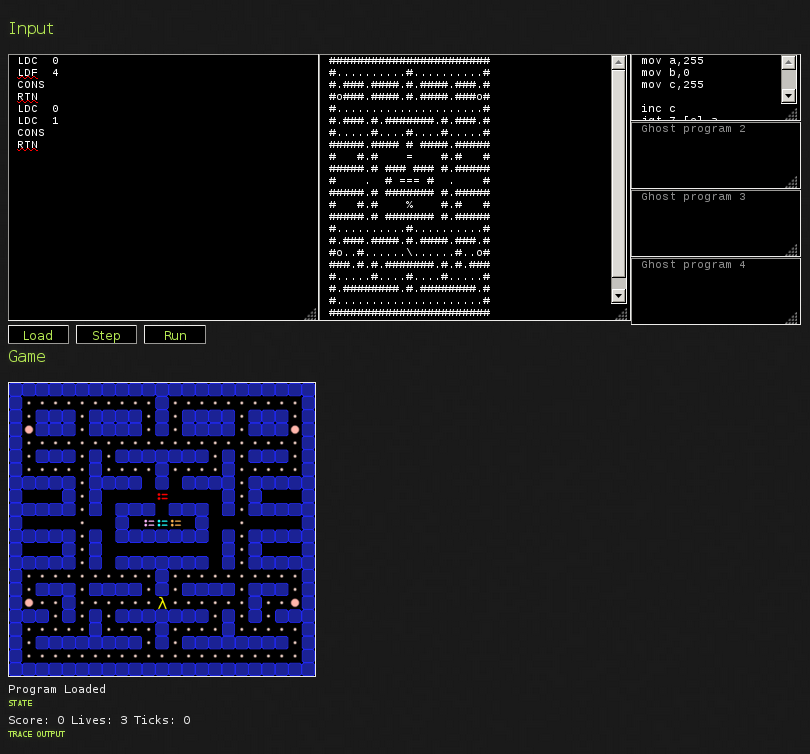

# Overview

- Ivory and Tower
- Haste
- ghcjs


---

# Ivory and Tower
--

## An experience report

- Autopilot for a military helicopter
- Deadline: 18 months
- http://dl.acm.org/citation.cfm?id=2628146&CFID=559949482&CFTOKEN=36745757

--

## Strategy

1. Design two new embedded programming languages from scratch
    - (14 person months)
--
2. Use these languages to write the actual code
    - (22 person months)

---

## Ivory

- Generates C-code
- EDSL itself is very restrictive (but Turing-complete)
- Use Haskell as macro system
- 6k lines of Haskell code

---

## Ivory

```haskell
[ivory|
struct fooStruct
  { bar :: Stored Uint8
  ; baz :: Array 10 (Stored Sint16)
  }
|]

setBaz :: Def ([Ref Global (Struct "fooStruct"), Sint16] :-> ())
setBaz = proc "setBaz" $ \ ref val -> body (prgm ref val)
    where
        prgm :: Ref Global (Struct "fooStruct") -> Sint16 -> Ivory eff ()
        prgm ref val = arrayMap $ \ ix -> store ((ref ~> baz) ! ix) val
```

```haskell
cmodule :: Module
cmodule = package "foo_module" $ do
    defStruct (Proxy :: Proxy "fooStruct")
    incl setBaz

main :: IO ()
main = void $ runCompiler [cmodule] initialOpts
```

---

## Ivory

foo_module.h:
```c
struct fooStruct {
    uint8_t bar;
    int16_t baz[10U];
};

void setBaz(struct fooStruct* n_var0, int16_t n_var1);
```

foo_source.c:
```c
#include "foo_module.h"

void setBaz(struct fooStruct* n_var0, int16_t n_var1) {
    for ( int32_t n_ix0 = (int32_t) 0
        ; n_ix0 <= (int32_t) 9
        ; n_ix0++ ) {
        n_var0->baz[n_ix0] = n_var1;
    }
}
```

---

## Ivory: Compiler error messages

```haskell
setBaz :: Def ([Ref Global (Struct "fooStruct"), Sint16] :-> ())
setBaz = proc "setBaz" $ \ ref val -> body (prgm ref val)
```

---

## Ivory: Compiler error messages

```haskell
setBaz :: Def ([Ref Global (Struct "fooStruct"), Sint16] :-> ())
setBaz = proc "setBaz" $ \ ref val _ -> body (prgm ref val)
```

--

```haskell
/mnt/slig-sda3/home/mf/fungroup/ivory.hs:89:10:
    No instance for (Ivory.Language.Proc.IvoryProcDef
                       ('[] ':-> ()) (t0 -> Body r0))
      arising from a use of ‘proc’
    In the expression: proc "setBaz"
    [...]

/mnt/slig-sda3/home/mf/fungroup/ivory.hs:89:41:
    No instance for (IvoryType r0) arising from a use of ‘body’
    The type variable ‘r0’ is ambiguous
    Note: there are several potential instances:
      instance (Ivory.Language.BitData.Bits.IvoryRep (BitRep n)) =>
               IvoryType (Bits n)
        -- Defined in ‘Ivory.Language.BitData.Bits’
      instance IvoryType Uint16 -- Defined in ‘Ivory.Language.Uint’
      instance IvoryType Uint32 -- Defined in ‘Ivory.Language.Uint’
      ...plus 19 others
    In the expression: body (prgm ref val)
    [...]
```

---

## Ivory

Guarantees:

- Well-typed, well-scoped memory management
- Well-typed C structs
- Well-typed register / bit fields
- Type-level array lengths!  (-:
- No nullable pointers
- No pointer arithmetic
- No unsafe casts, no void pointer

http://github.com/GaloisInc/ivory/blob/master/ivory/user-guide.md


---

## Tower

- Ivory library
- tasks (~ threads or processes)
- communication channels
- multiple backends (RTOSes, theorem provers, Graphviz)
- 3k lines of Haskell code


---

## Lessons Learned

- SMACCMPilot is 23kloc Ivory, Tower (48kloc C compiled)
- (Still uses some ArduPilot C++ libraries.)
--

- Types are awesome
--

- Bugs in the C backend are easy to work around (robust!)
--

- Bugs in Ivory, Tower are easy to fix
--

- Bad habits can be outlawed by changing the language


---

# Haste
--

## seamless, client-centric web application programming

- write both server and client code in haskell
- data types and application logic exist *only once*
- communicate via RPC (currently: web sockets)

https://github.com/valderman/haste-compiler

(Independent, similar project: https://github.com/takeoutweight/shade)


---

## example

```haskell
app = do
    remoteref <- liftServerIO $ newIORef 0

    count <- remote $ do
        r <- remoteref
        liftIO $ atomicModifyIORef r (\ v -> (v+1, v+1))

    runClient $ do
        visitors <- onServer count
        alert ("Your are visitor #" ++ show visitors)
```

```haskell
main :: IO ()
main = runApp (mkConfig "ws://localhost:1111" 1111) app
```


---

# ghcjs


---

## The ICFP programming contest




---

## The ICFP programming contest


---

## The ICFP programming contest


---

## The ICFP programming contest


http://icfpcontest.org/

http://icfpcontest.org/game.html


---

# ghcjs

- links against ghclib
- several new js-specific compiler phases
- light-weight GHC runtime threads (`forkIO`)
- template haskell runs on node.js!
- in-browser, real-time profiling!


--

## Performance

- lambdaman simulator: runtime is down to a factor of 20 relative to native
- 367k js code includes runtime, libs, application (minified, zipped)
- runtime alone is at 60k (un-minified, un-zipped source: 800k)
- improving rapidly


---

# ghcjs

## DOM lib

```haskell
import GHCJS.DOM
import GHCJS.DOM.Document
import GHCJS.DOM.HTMLElement

main = runWebGUI $ \ webView -> do
    Just doc <- webViewGetDomDocument webView
    Just body <- documentGetBody doc
    htmlElementSetInnerHTML body ("<p>hello world!</p>")
```


---

# ghcjs

## FFI

```haskell
{-# LANGUAGE JavaScriptFFI, CPP #-}

module Main where

#ifdef __GHCJS__
foreign import javascript unsafe "document.write($1+'<br/>');"
    writeNumber :: Int -> IO ()
foreign import javascript safe   "setTimeout($c, $1);"
    delay       :: Int -> IO ()
#else
writeNumber = error "writeNumber: only available from JavaScript"
delay = error "delay: only available from JavaScript"
#endif

main :: IO ()
main = mapM_ (\x -> writeNumber x >> delay 1000) [1..1000]
```


---

# ghcjs

## FFI

```haskell
x :: Int -> JSRef a -> IO ()
```

```javascript
var x = 5;
var y = h$c1(h$ghcjszmprimZCGHCJSziPrimziJSRef_con_e, o)
var action = h$c3(h$ap2_e, h$MainZCMainzix, x, y);
h$runSync(action, false);
```


---

## There is much more!

- HIW talk: http://www.youtube.com/watch?v=pXBJc4e9KIE
- code: https://github.com/ghcjs/ghcjs
- blog article (June 2013): http://weblog.luite.com/wordpress/?p=14
- blaze/react (brand new / alpha!): https://github.com/meiersi/blaze-react


---

# Thank you
